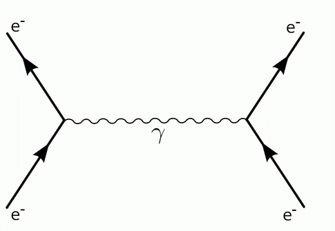
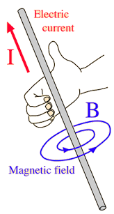

-> *forma "hmoty"*, silové pole, ktorého sila sa prenáša virtuálnymi fotónmi
	

## Stacionárne magnetické pole
**Kde sa vyskutuje**:
- okolie stacionárneho permanentného magnetu
- okolie vodiča s konštantným prúdom

*Siločiara* = `magnetická indukčná čiara`
-> priestorovo orientovaná uzavretá krivka, nikde sa nepretínajú
Dotyčnica je osou silového vektoru

**Homogénne magnetické pole** - magnetické pole, ktorého siločiary sú rovnobežné
napr. vo vnútri cievky alebo magnetu

### Magnetická indukcia
$$F_{mi}=\vec{B}\cdot{}\vec{I}\cdot{}l\cdot{}\sin\alpha$$
Jednotka $\textbf{Tesla} - T$

