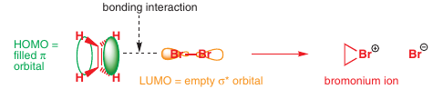
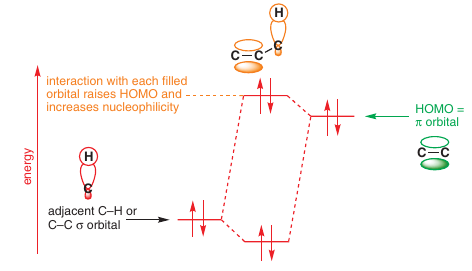
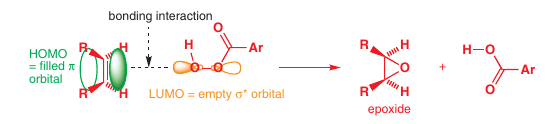
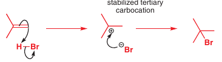
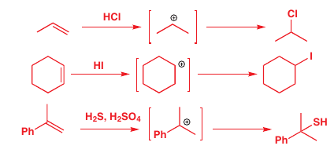
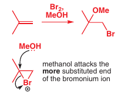

Pri reakcii dojde k *zmenšeniu násobnosti väzieb*

**Mechanizmus**:

Rýchlosť reakcie stúpa pri **vyššej substituovanosti** <- *zvyšuje HOMO*:

---

## Reakcie
### Epoxidácia alkénov
Reakcia formácie [epoxidov](../che/och/epoxidy.md), je *stereošpecifická* <- kyslík sa naväzuje na oba C z rovnakej strany
Ako činidlo vystupujú [peroxy-kyseliny]()

### Asymetrická kyslá adícia
Adícia H+ a X- na viacnásobnú väzbu, *asymetrická reakcia* <- [Markovnikovo pravidlo](../che/och/reakcie.md#Markovnikovo%20pravidlo)

Dokážeme tvoriť chloridy, jodidy, ba dokonca aj **tioly**

### Bromohydratácia

